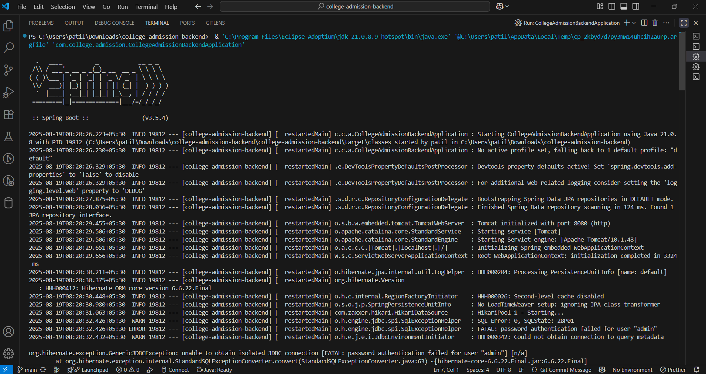
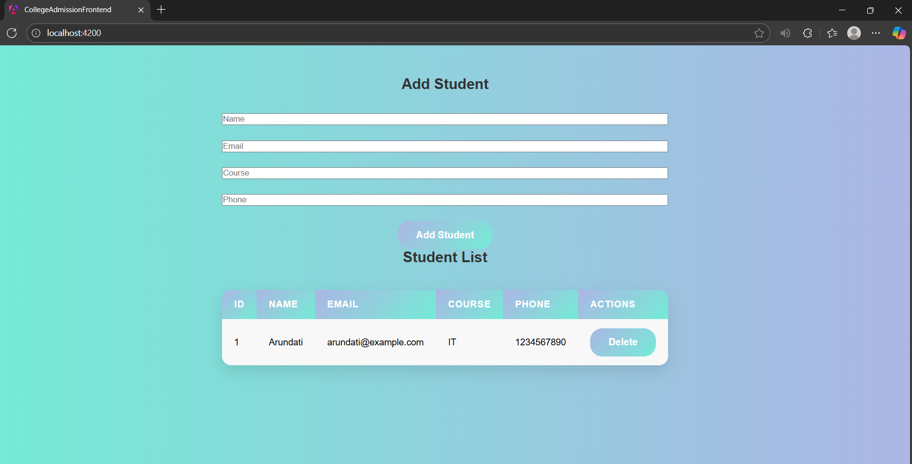

# 🎓 College Admission System  

 A full-stack **College Admission Management System** project built with modern technologies to simplify and digitalize the student admission process.  

- **Backend:** Spring Boot (Java, JPA, Hibernate, PostgreSQL)  
- **Frontend:** Angular (Components, Services, Routing, Forms, Bootstrap for UI)  
- **Database:** PostgreSQL (Relational Database for storing student & admission details)  
- **Build Tools:** Maven (Backend), Angular CLI (Frontend)  
- **API Communication:** RESTful APIs (Spring Boot ↔ Angular)  
- **IDE Used:** Eclipse/IntelliJ IDEA for backend, VS Code for frontend  
- **Version Control:** Git & GitHub for project hosting  
---

## Project Structure (in this repo)

```

College-Addmission/
├─ college-admission-backend/   # Spring Boot backend (Java, Maven, JPA/Hibernate)
├─ college-admission-frontend/  # Angular frontend (or React if used). Here we assume Angular.
└─ README.md (this file)

```

---

🚀 Features

✅ Student registration & management

✅ RESTful APIs with Spring Boot

✅ Angular frontend with service integration

✅ PostgreSQL persistence

✅ Proxy configuration / CORS setup

---

# 🚀 Backend (Spring Boot)


### Prerequisites

* Java 17+ (or Java 11 depending on your project setup)
* Maven 3.6+
* PostgreSQL (or H2 for testing)

---


### ⚡ Database Configuration 

```
spring.datasource.url=jdbc:postgresql://localhost:5432/college_db
spring.datasource.username=college_addmission_db
spring.datasource.password=arundati@44
spring.jpa.hibernate.ddl-auto=update
spring.jpa.properties.hibernate.dialect=org.hibernate.dialect.PostgreSQLDialect
server.port=8096
```
---


###  ▶️ Build & Run


From repository root or backend folder:

```bash
cd college-admission-backend
mvn clean package
# Run the jar
java -jar target/*.jar
# OR run directly with maven
mvn spring-boot:run
```


---


### ⚙️ Important Backend Files to Check


* `src/main/java/.../entity/Student.java` — Student entity mapping
* `src/main/java/.../repository/StudentRepository.java` — JPA repository
* `src/main/java/.../service/` — business logic
* `src/main/java/.../controller/StudentController.java` — REST endpoints
* `src/main/resources/application.properties` — DB & server config


---


### ⚙️ Common Backend Endpoints

* `GET  /api/students` — list students
* `GET  /api/students/{id}` — student by id
* `POST /api/students` — create student
* `PUT  /api/students/{id}` — update
* `DELETE /api/students/{id}` — delete


---

# Frontend (Angular)


### ✅ Prerequisites

* Node.js (16+ recommended)
* npm (or yarn)
* Angular CLI (if developing locally): `npm install -g @angular/cli`

---

### ▶️ Install & Run

```bash
cd college-admission-frontend
npm install
# If Angular project
ng serve --open
# or if package.json uses start script
npm start
```
---

###  🔗 Connect to Backend (CORS / Proxy)

Option A — Angular proxy (recommended for development)

Create `proxy.conf.json` in frontend folder:

```json
{
  "/api": {
    "target": "http://localhost:8096",
    "secure": false,
    "changeOrigin": true
  }
}
```
---

### 📑 Important Frontend Files to Check

* `src/app/` — components, services (look for `student.service.ts` or `api.service.ts`)
* `src/environments/environment.ts` — API base URLs
* `angular.json` / `package.json` — scripts and build config


---

# 🧪 Testing APIs

 Postman or curl to test endpoints.

Example curl to create student:

```bash
curl -X POST http://localhost:8096/api/students \
 -H "Content-Type: application/json" \
 -d '{"firstName":"Arundati","lastName":"Patil","email":"arundati@example.com","course":"IT"}'
```


---

## 📸 Project Screenshots  


### 🔹 Backend (Spring Boot)  


  


---


### 🔹 Frontend (Angular)  


  


---


## 👩‍💻 Author

**✨ Arundati Anand Patil**  

🎓 Diploma Third Year, Information Technology  

🏫 SVERI College of Engineering (Poly), Pandharpur  


---

## 📬 Contact

- 📧 Email: [patilarundhati44@gmail.com](mailto:patilarundhati44@gmail.com)  
- 🌐 GitHub: [patilarundhati44](https://github.com/patilarundhati44)  
- 📱 LinkedIn: *Arundati patil*  

---


---
